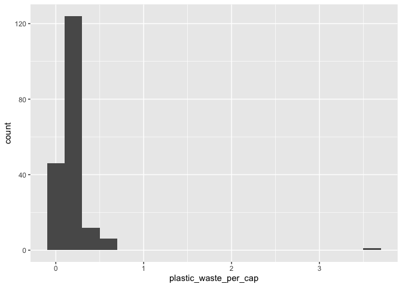
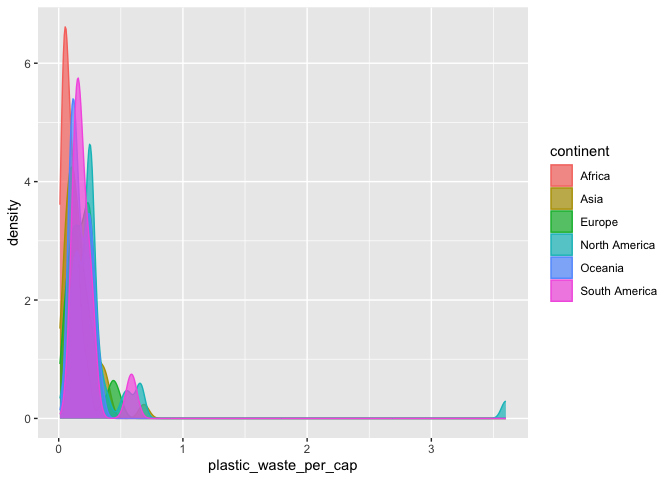
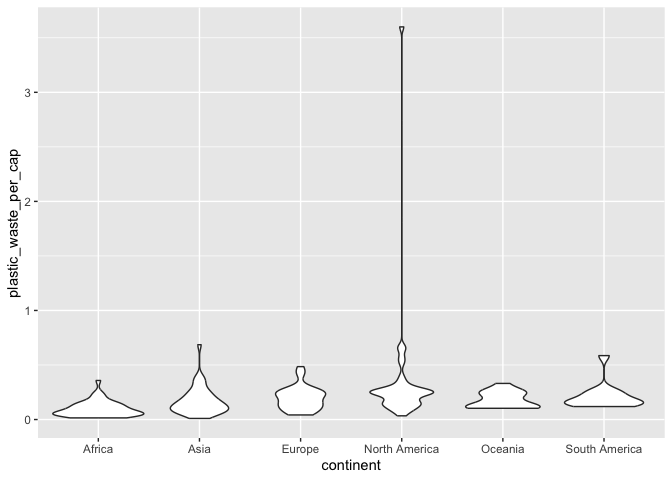
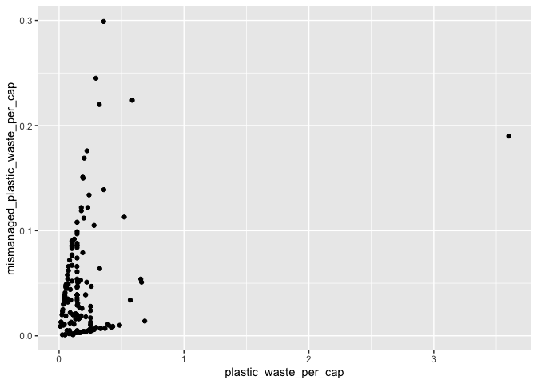
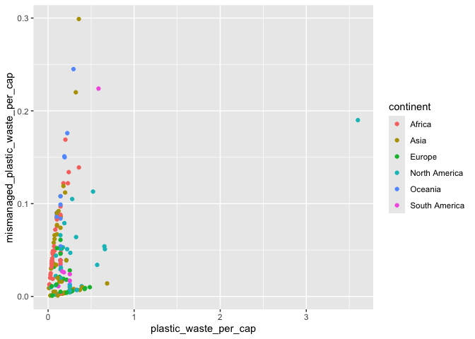
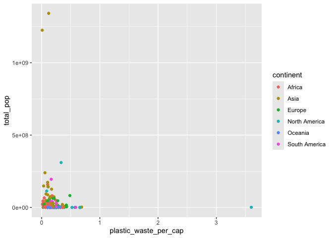
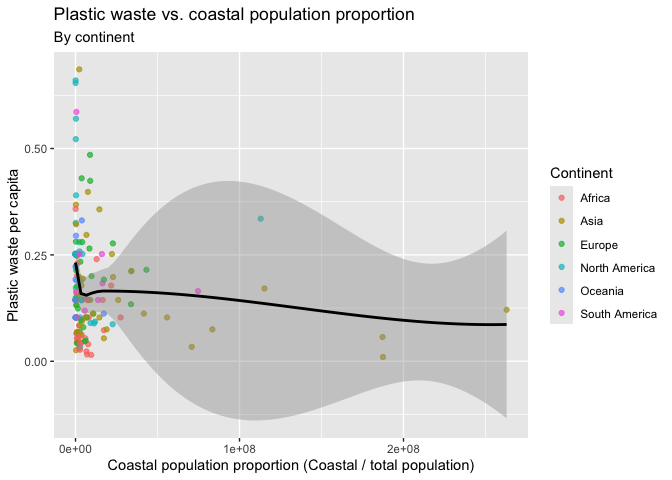

Lab 02 - Plastic waste
================
Enhui
01/20/2025

## Load packages and da

a

``` r
library(tidyverse) 
```

``` r
plastic_waste <- read.csv("data/plastic-waste.csv")
```

## Exercises

### Exercise 1

The distribution is right-skewed, suggesting that most countries produce
less plastic waste per capita, and a few countries produce more waste.
Also, the disparity in plastic waste is large between countries.

``` r
ggplot(data = plastic_waste, aes(x = plastic_waste_per_cap)) +
  geom_histogram(binwidth = 0.2)
```

    ## Warning: Removed 51 rows containing non-finite outside the scale range
    ## (`stat_bin()`).

<!-- -->

``` r
plastic_waste %>%
  filter(plastic_waste_per_cap > 3.5)
```

    ##   code              entity     continent year gdp_per_cap plastic_waste_per_cap
    ## 1  TTO Trinidad and Tobago North America 2010    31260.91                   3.6
    ##   mismanaged_plastic_waste_per_cap mismanaged_plastic_waste coastal_pop
    ## 1                             0.19                    94066     1358433
    ##   total_pop
    ## 1   1341465

### Exercise 2

Because color and fill represent different variables, we want the color
to represent different continents in the dataset. Alpha is used to
represent the transparency of the data and does not indicate any
variable differences in the data.

``` r
ggplot(
  data = plastic_waste,
  mapping = aes(
    x = plastic_waste_per_cap,
    color = continent,
    fill = continent
  )
) +
  geom_density(alpha = 0.7)
```

    ## Warning: Removed 51 rows containing non-finite outside the scale range
    ## (`stat_density()`).

<!-- -->

### Exercise 3

Violin plots show the peaks, which indicate where the data is
concentrated and the distribution of the data, but do not show in box
plots. Box plots show the median, quartiles, and outliers explicitly,
but violin plots do not explicitly show these statistics.

``` r
ggplot(
  data = plastic_waste,
  mapping = aes(
    x = continent,
    y = plastic_waste_per_cap
  )
) +
  geom_boxplot()
```

    ## Warning: Removed 51 rows containing non-finite outside the scale range
    ## (`stat_boxplot()`).

<!-- -->

``` r
ggplot(
  data = plastic_waste,
  mapping = aes(
    x = continent,
    y = plastic_waste_per_cap
  )
) +
  geom_violin()
```

    ## Warning: Removed 51 rows containing non-finite outside the scale range
    ## (`stat_ydensity()`).

<!-- -->

### Exercise 4

4.1 Based on the below scatterplot, I cannot see a clear relationship.
However,the majority points are located in the low plastic waster per
capita and low mismanaged plastic waster per capita, suggesting that
most continentes have small plastic waste and low mismanaged plastic
waster.  
4.2 It looks like Asia and Africa have more points with higer mismanaged
plastic waster per capita in the same levles of low plastic waster per
capita, indicating these two countires have a stronger assocation
between plastic waste and mismanaged plastic waster. It provides a more
clear distinction for Asia and Africa. 4.3 The plastic waste and costal
populaton appear to be more strongly linearly associated because the
points of the total population are evenly distributed.

``` r
ggplot(
  data = plastic_waste,
  mapping = aes(
    x = plastic_waste_per_cap,   
    y = mismanaged_plastic_waste_per_cap,
  )
) +
  geom_point()
```

    ## Warning: Removed 51 rows containing missing values or values outside the scale range
    ## (`geom_point()`).

<!-- -->

``` r
ggplot(
  data = plastic_waste,
  mapping = aes(
    x = plastic_waste_per_cap,   
    y = mismanaged_plastic_waste_per_cap,
    color = continent,
    fill = continent
  )
) +
  geom_point()
```

    ## Warning: Removed 51 rows containing missing values or values outside the scale range
    ## (`geom_point()`).

<!-- -->

``` r
ggplot(
  data = plastic_waste,
  mapping = aes(
    x = plastic_waste_per_cap,   
    y = total_pop,
    color = continent,
    fill = continent
  )
) +
  geom_point()
```

    ## Warning: Removed 61 rows containing missing values or values outside the scale range
    ## (`geom_point()`).

<!-- -->

``` r
ggplot(
  data = plastic_waste,
  mapping = aes(
    x = plastic_waste_per_cap,   
    y = coastal_pop,
    color = continent,
    fill = continent
  )
) +
  geom_point()
```

    ## Warning: Removed 51 rows containing missing values or values outside the scale range
    ## (`geom_point()`).

<!-- -->

### Exercise 5

Most countries with lower coastal populations have higher plastic waste
per capita. The black line does not show a linear relationship between
plastic waste and coastal population proportion. The plastic waste
starts to decrease at low coastal population proportions. Also, the
shaded region only has a few points, indicating the uncertainty about
the relationship in continents with higher coastal populations since it
represents the confidence interval. Asia has the most uncertainly in the
relationship between plastic waste and coastal population proportions,
whereas most other countries are concentrated at low plastic waste and
coastal population proportions.

``` r
filtered_data <- plastic_waste %>%
  filter(plastic_waste_per_cap <= 3)

ggplot(
  data = filtered_data,
  mapping = aes(
    y = plastic_waste_per_cap,   
    x = coastal_pop,
    color = continent,
  )
) +
  geom_point(alpha = 0.7) +
  geom_smooth(color = "black", method = 'loess', se= TRUE,) +  
  labs(
    title = "Plastic waste vs. coastal population proportion",
    subtitle = "By continent",
    x = "Coastal population proportion (Coastal / total population)",
    y = "Plastic waste per capita",
    color = "Continent")
```

    ## `geom_smooth()` using formula = 'y ~ x'

<!-- -->
